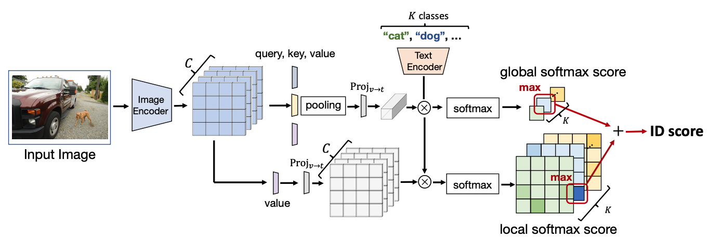

# GL-MCM: Global and Local Maximum Concept Matching for Zero-Shot Out-of-Distribution Detection (IJCV2025)

|⚠️ The previous version of this paper is "Zero-Shot In-Distribution Detection in Multi-Object Settings Using Vision-Language Foundation Models". We change the paper title and presentation. However, the methodology of GL-MCM is the same. So, Please enjoy our GL-MCM as before.|
|-----------------------------------------|


 

This codebase provides a Pytorch implementation for the paper "GL-MCM: Global and Local Maximum Concept Matching for Zero-Shot Out-of-Distribution Detection" (IJCV2025).

### Abstract
Zero-shot out-of-distribution (OOD) detection is a task that detects OOD images during inference with only in-distribution (ID) class names. Existing methods assume ID images contain a single, centered object, and do not consider the more realistic multi-object scenarios, where both ID and OOD objects are present. To meet the needs of many users, the detection method must have the flexibility to adapt the type of ID images. To this end, we present Global-Local Maximum Concept Matching (GL-MCM), which incorporates local image scores as an auxiliary score to enhance the separability of global and local visual features. Due to the simple ensemble score function design, GL-MCM can control the type of ID images with a single weight parameter. Experiments on ImageNet and multi-object benchmarks demonstrate that GL-MCM outperforms baseline zero-shot methods and is comparable to fully supervised methods. Furthermore, GL-MCM offers strong flexibility in adjusting the target type of ID images. The code is available via this https URL.


### Illustration
#### Global-Local Maximum Concept Matching (GL-MCM)



# Set up

## Required Packages
We have done the codes with a single Nvidia A100 (or V100) GPU.
We follow the environment in [MCM](https://github.com/deeplearning-wisc/MCM).

Our experiments are conducted with Python 3.8 and Pytorch 1.10.
Besides, the following commonly used packages are required to be installed:
```bash
$ pip install ftfy regex tqdm scipy matplotlib seaborn tqdm scikit-learn
```

# Data Preparation
## In-distribution Datasets
We use following datasets as ID:
- `COCO_single`: used in Table1, Table3, and Table4 (Each Image in COCO_single has single-class ID objects and one or more OOD objects)
- `VOC_single`: used in Table1 and Table3 (Each Image in VOC_single has single-class ID objects and one or more OOD objects)
- `ImageNet`: used in Table2
- `COCO_multi`: used in supplementary (Each Image in COCO_multi has multi-class ID objects and one or more OOD objects)    

We provide our curated ID and OOD datasets via [this url](https://drive.google.com/file/d/1he4jKi2BfyGT6rkcbFYlez7PbLMXTBMR/view?usp=sharing).   
For ImageNet-1k, we use the validation partion of the [official provided dataset](https://image-net.org/challenges/LSVRC/2012/index.php#).    
After downloads and, please set the datasetes to `./datasets` 
<!-- For other datasets, please download them via [this url](https://drive.google.com/file/d/1Wn5zGQQzadsvza86shO_ydpyCu5-k2eN/view?usp=share_link).         
After downloads, please set the datasetes to `./datasets`     -->

## Out-of-Distribution Datasets
We use the large-scale OOD datasets [iNaturalist](https://arxiv.org/abs/1707.06642), [SUN](https://vision.princeton.edu/projects/2010/SUN/), [Places](https://arxiv.org/abs/1610.02055), and [Texture](https://arxiv.org/abs/1311.3618) curated by [Huang et al. 2021](https://arxiv.org/abs/2105.01879). We follow instruction from the this [repository](https://github.com/deeplearning-wisc/large_scale_ood#out-of-distribution-dataset) to download the subsampled datasets. For ImageNet-22K, we use this [url](https://drive.google.com/drive/folders/1BGMRQz3eB_npaGD46HC6K_uzt105HPRy) in this [repository](https://github.com/deeplearning-wisc/multi-label-ood) curated by [Wang et al. 2021](https://arxiv.org/abs/2109.14162)

In addition, we also use ood_coco and ood_voc in [this url](https://drive.google.com/file/d/1he4jKi2BfyGT6rkcbFYlez7PbLMXTBMR/view?usp=sharing). 

The overall file structure is as follows:

```
GL-MCM
|-- datasets
    |-- ImageNet
    |-- ID_COCO_single
    |-- ID_VOC_single
    |-- ID_COCO_multi
    |-- OOD_COCO
    |-- OOD_VOC
    |-- iNaturalist
    |-- SUN
    |-- Places
    |-- Texture
    |-- ImageNet-22K
    ...
```

# Quick Start

The main script for evaluating OOD detection performance is `eval_ood_detection.py`. Here are the list of arguments:

- `--name`: A unique ID for the experiment, can be any string
- `--score`: The OOD detection score, which accepts any of the following:
  - `MCM`: [Maximum Concept Matching score](https://arxiv.org/pdf/2211.13445.pdf)
  - `L-MCM`: Local MCM (ours)
  - `GL-MCM`: Global-Local MCM (ours)
- `--seed`: A random seed for the experiments
- `--gpu`: The index of the GPU to use. For example `--gpu=0`
- `--in_dataset`: The in-distribution dataset
  - Accepts: `ImageNet`, `COCO_single`, `COCO_multi`, `VOC_single`
- `-b`, `--batch_size`: Mini-batch size
- `--CLIP_ckpt`: Specifies the pretrained CLIP encoder to use
  - Accepts: `RN50`, `RN101`, `ViT-B/16`.
- `--num_ood_sumple`: the number of OOD samples
- `--lambda_local`: the weight for the local score

The OOD detection results will be generated and stored in  `results/in_dataset/score/CLIP_ckpt_name/`. 

We provide bash scripts:

We provide bash scripts:

```sh
sh scripts/eval_imagenet.sh
```

```sh
sh scripts/eval_coco_single.sh
```

# Acknowledgement 
This code is based on the implementations of [MCM](https://github.com/deeplearning-wisc/MCM)


# Citaiton
If you find our work interesting or use our code/models, please cite:
```bibtex
@article{miyai2023zero,
  title={GL-MCM: Global and Local Maximum Concept Matching for Zero-Shot Out-of-Distribution Detection},
  author={Miyai, Atsuyuki and Yu, Qing and Irie, Go and Aizawa, Kiyoharu},
  journal={IJCV},
  year={2025}
}
